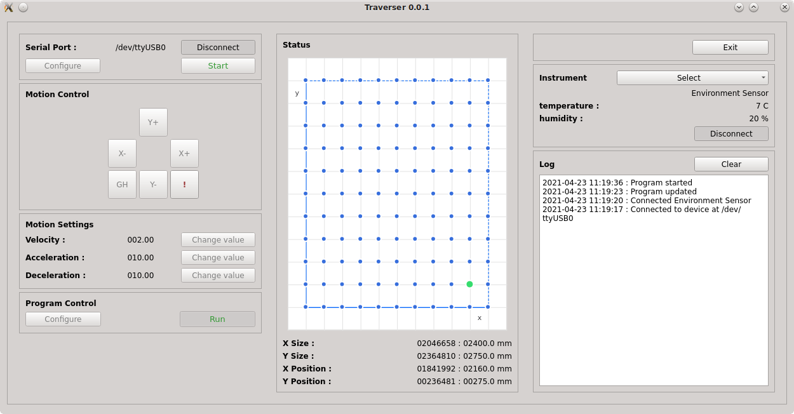

<div align="center">
<a href="https://www.cemac.leeds.ac.uk/">
  </a>
  <br>
</div>

## Traverser



### Requirements

The code is Python based (tested with various version of Python3), and has the following dependencies:

  * [PyQT5](https://www.riverbankcomputing.com/software/pyqt/intro)
  * [PyQTChart](https://www.riverbankcomputing.com/software/pyqtchart/)
  * [pySerial](https://github.com/pyserial/pyserial)

### Overview

The Traverser software controls traverse experiment systems via two ViX500IM motor controllers, which are connect via a serial connection.

The software can be used to move the traverse manually, or programmatically, and record measurements from a connected instrument, and record these readings to a CSV file.

### Running the program

If all requirements are available, the program can be run using the command:

```
python traverser.py
```

For testing purposes, the file `traverser/ui.py` points to code which (roughly) emulates the expected behaviour of the real devices.

To use the testing code, in `ui.py`:

```
from traverser.dummy_vixim import VixIM
```

To connect to a real traverse system over serial:

```
from traverser.vixim import VixIM
```
